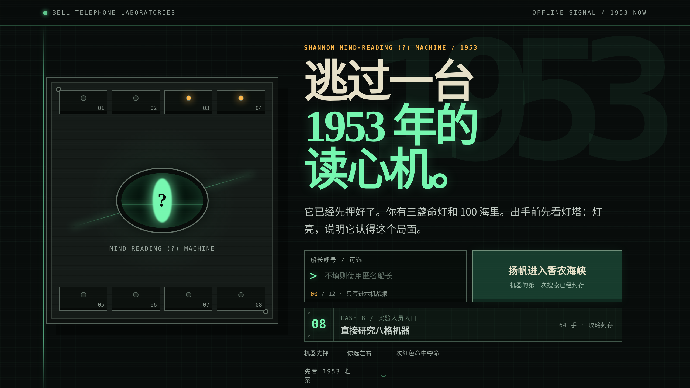

# 香农读心机

> 机器已经先押好了。轮到你骗它。

一场由八只继电器记忆格追着你跑的浏览器游戏。

[现在挑战香农读心机 →](https://shoot5313.github.io/shannon-mind-reader-1953/)

[](https://shoot5313.github.io/shannon-mind-reader-1953/)

小红书小工具里也有同名的《香农读心机》，审核周期较长，版本会比这里慢一些。

## 故事从 1953 年开始

1953 年 3 月 18 日，Claude Shannon 在贝尔实验室写下了一份四页打字稿，题目叫 *A Mind-Reading (?) Machine*。

原稿开头先把功劳给了同事 David W. Hagelbarger：Shannon 写的是 Hagelbarger 那台机器的简化版。它没有神经网络，也不需要知道你是谁。它只有八格继电器记忆，反复和人玩同一个左右游戏，把刚才发生的事一格一格记下来。

题目里的问号很诚实。机器真的会读吗？还是它只是比人更有耐心地记住规律。

这场游戏最漂亮的规矩是：**机器必须先押。** 每一手的猜测都会在你按下左或右之前封存，出手后才一起揭晓。它抓住你，不靠事后改答案；你骗过它，也确实是你赢了。

我们把这台机器搬进了浏览器，又给了它一片有探照灯的海峡、一张藏宝图，以及一颗有点欠揍的“香农严选聪明蛋”。

## 先去抢那张藏宝图

你有三盏命灯，要穿过 100 海里的香农海峡。

- 前 10 海里风平浪静，机器只看，不抓。
- 此后海面转成风浪区。每个路口选左或右，连续三次被探照灯抓中，就会熄灭一盏命灯。
- 第 80 海里起大浪滔天，规则收紧：连中两次就掉一盏灯。进入时机器会明说。
- 带着至少一盏灯抵达终点，藏宝图归你。剩下的命灯越多，发现的宝物越稀有。

**出手前先看灯塔。** 灯亮，说明机器认得眼下这个局面，它有把握；灯暗，它只能瞎猜。灯只报把握的强弱，永远不报它押了哪边——那要等你出手之后才揭晓。

灯什么时候亮，是你自己教给它的。所以这盏灯的用法不写在这里：那是第二场游戏。

前 10 海里灯基本不亮，机器还没见过任何局面。这段不掉命，正好用来学会看灯。再走一会儿，灯会越来越常亮，探照灯也会越来越像是冲着你来的。

一局结束时，机器会把它读到的东西摆出来：你在连续两次走同一边之后有多大概率换边、检验了多少次、p 值多少。抓到就直说抓到，没抓到也直说没抓到，样本不够就不下结论。

结算会同时给两样东西：一枚**蛋**（这局打得多好）和一个**行为称号**（你是怎么打的）。称号由四项检验决定——留还是换、亮灯时是否改打法、输赢是否影响你、有没有左右偏好——每项都要过显著性检验才会写上去，过不了就明写「未测出」。四项全都没读到的人叫**无名氏**，这是最难拿的一个。

两者分成两张战报图：蛋卡是结果，称号卡是依据。

想直接研究机器，可以从大厅的 `CASE 8` 实验人员入口进入八格研究室；航行结算页也留着一份未登记档案。研究档案分成八组，每组八手：领先是 `100% 聪明蛋`，平手是 `100% 普通蛋`，落后是 `100% 笨蛋`。每格会实时留下 `×N` 访问数；64 手结束时，前两手用于建立局面，余下 62 次翻阅会生成一张属于本局的八格访问谱。机器里还封着一份未署名档案，触发条件不写在这里。

64 手不是 Shannon 原稿规定的局数。原机可以一直玩下去。研究室里每一步都要看八格、猜机器，认知长度远长于航海；所以我们把它收成 `8 × 8`，保留研究感，不把解谜拖成耐力赛。冒险航程是 100 海里。

结算时它还会告诉你，八格里哪一格最容易被读穿——那是你自己的透明度，不是格子里存的东西。

## 八格里到底记了什么

<details>
<summary>建议先玩一局再展开</summary>

八只记忆格对应八种最近局面。每只格子会记录玩家在这种局面下的反应，并按 Shannon 原稿里的规则决定自己是否已经学到足够的东西。没有可用记忆时，机器只能随机押一边。

界面会告诉你哪只格子正在工作、哪只已经接通，但不会公开格子里记住的方向。这里也不提供破解步骤：研究机器本身就是第二场游戏。

</details>

## 在本地运行

```bash
git clone https://github.com/shoot5313/shannon-mind-reader-1953.git
cd shannon-mind-reader-1953
npm run serve
```

打开 `http://localhost:4173/`。直接打开 `index.html` 也能运行。

跑测试：

```bash
npm test
```

<details>
<summary>代码从哪里看</summary>

- `src/engine.js`：Shannon 八格预测器、习惯检验、比分与称号
- `src/unified-entry.js`：1953 大厅、昵称与冒险入口
- `src/two-mode-prototype.js`：海峡追逐、八格研究室与战报生成
- `tests/`：先押后选、八格学习、隐藏档案边界与发布包回归测试
- `experiments/tune-adventure.cjs`：难度校准。改航程长度或成就阈值之前先跑它
- [DESIGN.md](./DESIGN.md)：这台机器是怎么调出来的——试过什么、砍掉什么、每个数字怎么来的

</details>

## 原始资料

- Claude E. Shannon, [*A Mind-Reading (?) Machine*](https://this1that1whatever.com/miscellany/mind-reader/Shannon-Mind-Reading.pdf), Bell Laboratories, 18 March 1953。后收入 N. J. A. Sloane 与 Aaron D. Wyner 编的 *Claude Elwood Shannon: Collected Papers*, pp. 688–690。
- D. W. Hagelbarger, [*SEER, A SEquence Extrapolating Robot*](https://doi.org/10.1109/TEC.1956.5219783), *IRE Transactions on Electronic Computers*, EC-5(1), 1956, pp. 1–7。
- N. J. A. Sloane, [Claude Shannon bibliography](https://neilsloane.com/doc/shannonbib.html)，其中第 73 项是这份 1953 年打字稿。

原稿很短。建议先玩，再读。

## License

[MIT](./LICENSE) · © 2026 shoot5313
