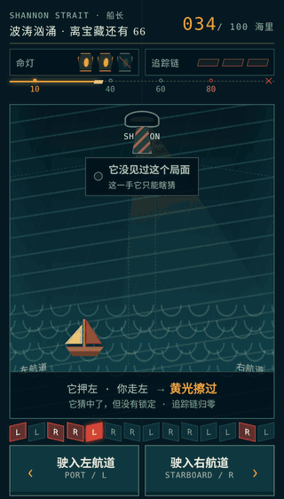
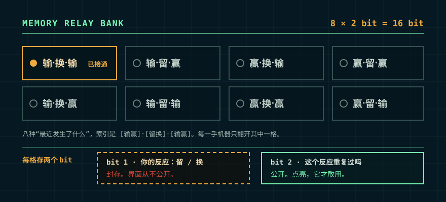

# 香农读心机

**中文** · [English](./README.en.md)

> 机器已经先押好了。轮到你骗它。

一台 1953 年的读心机，搬进了浏览器。零参数，零训练数据，零网络请求，全部记忆只有 16 个 bit。

每一手开始前，它先在左和右之间押一个答案。答案锁死，你再出手。

[现在挑战香农读心机 →](https://shoot5313.github.io/shannon-mind-reader-1953/)

[](https://shoot5313.github.io/shannon-mind-reader-1953/)

小红书小工具里也有同名的《香农读心机》，审核周期较长，版本会比这里慢一些。

想看这台机器是怎么调出来的——试过什么、砍掉什么、每个数字怎么来的：[DESIGN.md](./DESIGN.md)。

## 故事从 1953 年开始

1953 年 3 月 18 日，Claude Shannon 在贝尔实验室写下了一份四页打字稿，题目叫 *A Mind-Reading (?) Machine*。

原稿开头先把功劳给了同事 David W. Hagelbarger：Shannon 写的是 Hagelbarger 那台机器的简化版。它没有神经网络，也不需要知道你是谁。它只有八格继电器记忆，反复和人玩同一个左右游戏，把刚才发生的事一格一格记下来。

题目里的问号很诚实。机器真的会读吗？还是它只是比人更有耐心地记住规律。

这场游戏最漂亮的规矩是：**机器必须先押。** 每一手的猜测都会在你按下左或右之前封存，出手后才一起揭晓。它抓住你，不靠事后改答案；你骗过它，也确实是你赢了。

这条不用信我。`tests/engine.test.cjs` 第 43 行那条测试就在验证它：先取两次预测确认是同一个，再故意选相反的一边，断言机器记下的仍是它原来押的那个。跑 `npm test` 十秒钟就能自己看。

我们把这台机器搬进了浏览器，又给了它一片有探照灯的海峡、一张藏宝图，以及一颗有点欠揍的「香农严选聪明蛋」。

[](https://shoot5313.github.io/shannon-mind-reader-1953/)

## 先去抢那张藏宝图

你有三盏命灯，要穿过 100 海里的香农海峡。

- 前 10 海里风平浪静，机器只看，不抓。
- 此后海面转成风浪区。每个路口选左或右，连续三次被探照灯抓中，就会熄灭一盏命灯。
- 第 80 海里起大浪滔天，规则收紧：连中两次就掉一盏灯。进入时机器会明说。
- 带着至少一盏灯抵达终点，藏宝图归你。剩下的命灯越多，发现的宝物越稀有。
- 回收物按难度累计：三盏灯抵达会同时补齐一灯、二灯和三灯三件宝物，不必故意打差去补低阶收藏。
- 如果 100 海里没有出现一次红光锁定，三灯宝藏之上还藏着一份「问号原稿」。灯暗时的随机猜中不算红光——这个条件奖励的是读懂机器，不是赌运气。

出手前先看灯塔。灯亮，说明机器认得眼下这个局面，它有把握；灯暗，它只能瞎猜。灯只报把握的强弱，永远不报它押了哪边——那要等你出手之后才揭晓。

灯什么时候亮，是你自己教给它的。所以这盏灯的用法不写在这里：那是第二场游戏。

前 10 海里灯基本不亮，机器还没见过任何局面。这段不掉命，正好用来学会看灯。再走一会儿，灯会越来越常亮，探照灯也会越来越像是冲着你来的。

一局结束时，机器会把它读到的东西摆出来：你在连续两次走同一边之后有多大概率换边、检验了多少次、p 值多少。抓到了就直说抓到，没抓到也一样直说。样本太薄的时候，它干脆不下结论。

结算会同时给两样东西：一枚蛋（这局打得多好）和一个行为称号（你是怎么打的）。

称号看四件事：连续两次同边后你留还是换、灯亮时会不会改打法、被抓之后会不会变、有没有左右偏好。卡上写的是这一局的真实数字——「你留边 62%」就是这 64 手里发生的事，不需要任何检验。其中真正经得起显著性检验的那几项，会额外盖一枚「已核验」。

所以人人都有称号，而章要靠规律赚。四项都平得像抛硬币的人叫无名氏。

两者分成两张战报图：蛋卡是结果，称号卡是依据。

## 香农档案柜

大厅右上角和每局底部都能打开档案柜。它有六个固定槽位：余烬金币、继电罗盘、香农密钥、问号原稿，以及 `CASE 8` 签发的香农破解章和重点观察章。未获得的物品也保留名称与线索，所以隐藏的是触发办法，不是「后面还有没有东西」。幽默的蛋仍是结算主角；它下面的档案回执会明确告诉你，聪明蛋还不是最后一份档案。

三份隐藏档案会根据本机最佳结果给出逐级响应：继电触点从静默到亮起、原稿从干扰到显影，但界面不公布精确阈值，也不教反制步骤。每次刷新个人最佳，结算和分享图都会留下新的证据；重复完成已经签发的章还会累计核验次数。六件齐备后，档案柜会打开一张可保存的「1953 实验总档」。

结算过一次对应模式后，可以在下一局切换「标准 / 快速」继电速度。它只缩短揭晓等待，不改机器、规则或随机性，方便继续试路线和研究八格。

收藏跨局保存在当前设备。除六个解锁编号外，只保存结算次数、最远航程、最少红光和 `CASE 8` 两端最佳结果等匿名汇总数字；昵称、完整路线和逐手选择都不保存，也不会上传。档案柜内可以两次确认后一键清空。本地数据被系统清理时，收藏也会随之消失。

## 八格研究室

想直接研究机器，可以从大厅的 `CASE 8` 实验人员入口进入八格研究室；航行结算页也留着一份未登记档案。研究档案分成八组，每组八手：领先是 `100% 聪明蛋`，平手是 `100% 普通蛋`，落后是 `100% 笨蛋`。每格会实时留下 `×N` 访问数；64 手结束时，前两手用于建立局面，余下 62 次翻阅会生成一张属于本局的八格访问谱。机器里还封着一份未署名档案，触发条件不写在这里。

64 手不是 Shannon 原稿规定的局数。原机可以一直玩下去。研究室里每一步都要看八格、猜机器，认知长度远长于航海；所以我们把它收成 `8 × 8`，保留研究感，不把解谜拖成耐力赛。冒险航程是 100 海里。

结算时它还会告诉你，八格里哪一格最容易被读穿。那是你自己的透明度。格子里存了什么，仍然不给看。

## 八格，十六比特



<details>
<summary>建议先玩一局再展开</summary>

八只记忆格对应八种最近局面，索引是 `[输赢]·[留换]·[输赢]`。每格存两个比特：

- 你在这个局面下的反应，留还是换
- 它有没有重复出现过，因为原稿的规则是：一个反应要见过第二次，机器才敢用它

八格 × 二比特 = 一共 16 bit 记忆。界面公开的正好是其中一半：哪格正在翻阅、哪格已接通、你去过几次。格子里记住的方向始终封存。

冒险模式的探照灯泄露的是同一半，只是一次一格：它告诉你机器有把握，从不告诉你它押哪边。

这里不提供解码表，也不提供反制步骤：研究机器本身就是第二场游戏。

</details>

## 在本地运行

```bash
git clone https://github.com/shoot5313/shannon-mind-reader-1953.git
cd shannon-mind-reader-1953
npm run serve
```

打开 `http://localhost:4173/`。直接打开 `index.html` 也能运行。

跑测试：

```bash
npm test
```

<details>
<summary>代码从哪里看</summary>

- `src/engine.js`：Shannon 八格预测器、习惯检验、比分与称号
- `src/unified-entry.js`：1953 大厅、昵称与冒险入口
- `src/two-mode-prototype.js`：海峡追逐、八格研究室与战报生成
- `tests/`：先押后选、八格学习、隐藏档案边界与发布包回归测试
- `experiments/tune-adventure.cjs`：难度校准。改航程长度或成就阈值之前先跑它
- [DESIGN.md](./DESIGN.md)：这台机器是怎么调出来的——试过什么、砍掉什么、每个数字怎么来的

</details>

## 原始资料

- Claude E. Shannon, [*A Mind-Reading (?) Machine*](https://this1that1whatever.com/miscellany/mind-reader/Shannon-Mind-Reading.pdf), Bell Laboratories, 18 March 1953。后收入 N. J. A. Sloane 与 Aaron D. Wyner 编的 *Claude Elwood Shannon: Collected Papers*, pp. 688–690。
- D. W. Hagelbarger, [*SEER, A SEquence Extrapolating Robot*](https://doi.org/10.1109/TEC.1956.5219783), *IRE Transactions on Electronic Computers*, EC-5(1), 1956, pp. 1–7。
- N. J. A. Sloane, [Claude Shannon bibliography](https://neilsloane.com/doc/shannonbib.html)，其中第 73 项是这份 1953 年打字稿。

原稿很短。建议先玩，再读。

## License

[MIT](./LICENSE) · © 2026 shoot5313
